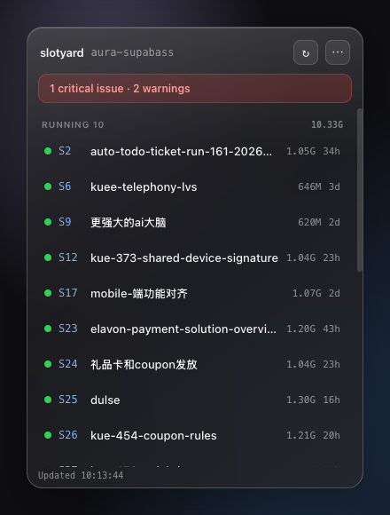
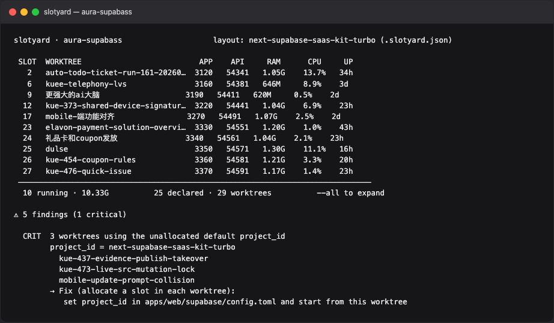

# slotyard

Tells you the truth about the parallel dev environments on your machine — which
ones are real, and which ones are quietly contaminating each other.

If you run several git worktrees of the same project, each with its own local
Supabase stack, you already know the failure mode: two worktrees end up on the
same `project_id`, share one database, and nothing anywhere reports an error.
Your integration tests just start failing for no visible reason.

<p align="center">
  
</p>

The same scan from the CLI — live docker stats, CJK worktree names, and the
finding that three worktrees are still on the unallocated default `project_id`:

<p align="center">
  
</p>

## Why docker cannot tell you this itself

docker only does reference counting. It has no idea what a git worktree is, so
it cannot distinguish:

- a cold environment you will resume tomorrow, and
- the remains of a worktree deleted three weeks ago

To docker they look identical: an exited container with a volume attached. Both
are "in use", so `docker volume prune` will never touch either.

There is a sharper version of this. These two commands are individually
reasonable and jointly destructive:

```bash
docker container prune   # looks harmless: only removes stopped containers
docker volume prune      # looks harmless: only removes unreferenced volumes
```

The first one deletes the exited containers that were the *only* thing keeping
those volumes referenced. Run them in that order and every cold environment's
database is gone. Nothing warns you.

## What it does

Joins three sources on the slot number and reports where they disagree:

| Source | Answers |
|---|---|
| `docker ps -a` labels, `docker volume ls` | which containers and volumes exist, and whose they are |
| `git worktree list` | which worktrees exist |
| each worktree's `config.toml` | which slot each one believes it has |

Anything that fails to line up is a finding. No daemon, no database, no
background service — one command, probed live, exits when done.

## Install

```bash
git clone https://github.com/YOMOO-LLC/slotyard && cd slotyard && npm link
```

Or, once the package is on the npm registry:

```bash
npm i -g slotyard
```

Node 22.18+ (native TypeScript stripping), git, docker, lsof. No dependencies,
no build step. The npm package is the CLI only; the menu-bar app is not shipped
there.

**macOS is supported.** Linux is best-effort: the same probes (`docker`, `git`,
`lsof`) exist, the tray app does not. Windows is not supported.

## Use

```bash
slotyard                    # read-only checkup (this is the default)
slotyard alloc              # print a slot number nobody is using
slotyard wake  <slot>       # start containers that exist but are stopped
slotyard sleep <slot>       # stop the services that are safe to stop
slotyard --json             # structured output, for editors and menu bars
```

`slotyard --help` lists every flag.

### alloc

`alloc` prints one number to stdout and writes nothing:

```bash
SLOT=$(slotyard alloc)
```

Occupancy comes from probing, never from a registry file: container labels, every
worktree's `config.toml`, the ports bound right now, and the ports every
container *declares* it will bind — including stopped ones, because a cold stack
holds no ports until the moment it starts.

It cannot prevent a race on its own. If you create worktrees in parallel, hold a
lock across **both** the request and the write — locking only the `alloc` call
achieves nothing, because the window is between the two.

### wake / sleep

`sleep` stops only services that carry no data: studio, pg_meta, inbucket,
realtime, edge_runtime, storage. `db`, `auth`, `kong` and `rest` are never
touched, and no flag overrides that.

Both use `docker start` / `docker stop` directly, which sidesteps a real trap:
`supabase start` is a silent no-op when only *some* containers are stopped. It
prints "already running", exits 0, and leaves them down.

## Connecting your project

Two levels. Most projects stop at the first.

**Level 0 — nothing to do, for a single environment.** slotyard finds your
`supabase/config.toml` and infers the prefix, the base ports and where the file
lives. A stock Supabase project with one local stack works out of the box.

**Parallel worktrees need a naming convention.** slotyard joins on slot number.
It expects the main repo's `project_id` to be a stable prefix, and every other
worktree to use `${prefix}-sN` (slot 4 → `myapp-s4`). That is a project
convention, not a Supabase rule — set `prefix` in `.slotyard.json` if inference
would be wrong. If every worktree still has the hashed id `supabase init`
generated, doctor cannot tell which environments belong together, and the
report will look empty rather than wrong.

`alloc` prints a number and writes nothing. You put that number into
`config.toml` (what the supabase CLI actually reads). That split is
intentional: a read-only tool does not need to be trusted with your config.

**Level 1 — `.slotyard.json`** at the repo root, for the parts that cannot be
inferred:

```json
{
  "ports": { "web": 3000, "metro": 8081 }
}
```

Those are your app's own ports; supabase's config knows nothing about them.
Everything else — `prefix`, `configPath`, `step`, `maxSlot`, `fixUp` — is optional
and overrides what was inferred. `fixUp` is the paste-ready command to run after
`cd` into a worktree (doctor never runs it). Without it, suggestions use
`slotyard alloc` and tell you to edit `config.toml`.

> A spec declares **conventions** (what the port formula is), never **state**
> (who currently holds slot 7). Conventions are decisions and belong in files.
> State is an observable fact and must be probed. An `assignments` field here
> would cross that line, and turn this tool into the thing it exists to
> eliminate.

## Running several projects at once

Two Supabase projects both generated by `supabase init` have *identical* port
ranges, so their slot spaces overlap. slotyard handles this without any
configuration: `alloc` avoids ports held by any container on the machine,
including other projects' stopped stacks.

Known limit: a slot another project has declared in its `config.toml` but never
started is invisible. Nothing on the machine points at it yet, and finding it
would require knowing where every repo lives — which is a registry, which is
exactly what this tool refuses to be.

## What it will never do

**It does not delete anything.** No `docker rm`, no volume removal, no prune. It
finds the orphan, hands you the command, and you decide. A tool that deletes a
database by mistake once does not get a second chance.

`doctor` and `alloc` are strictly read-only. `wake` and `sleep` are the only
write paths, and they change container state, never data.

## Development

```bash
node --test src/*.test.ts src/layouts/*.test.ts   # 64 unit tests, no docker needed
test/e2e.sh                                       # 12 assertions against real docker
```

The probe layer has no unit tests on purpose — mocking docker, lsof and git would
be testing the mocks. `test/e2e.sh` builds a throwaway fixture with its own
prefix and port range instead. See [CLAUDE.md](CLAUDE.md) for the invariants
worth knowing before changing anything, and [DECISIONS.md](DECISIONS.md) for why
things are the way they are.

MIT.
